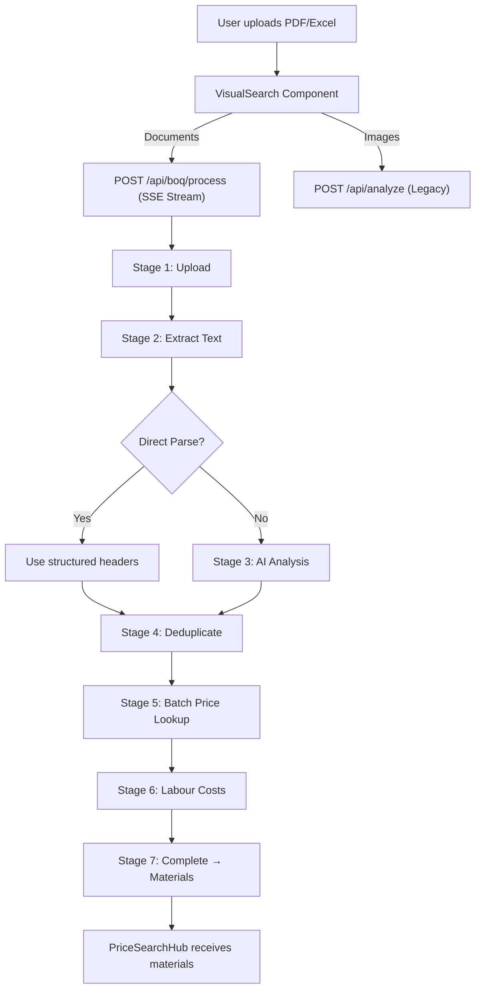

# BOQ Processing Pipeline — Implementation Summary

**Date:** 2026-04-22  
**Status:** ✅ Implemented & Build Verified

---

## Architecture Overview



## New Files

| File | Purpose |
|------|---------|
| `src/lib/boq-engine.ts` | Core BOQ processing engine (extraction, dedup, caching, normalization) |
| `src/app/api/boq/process/route.ts` | SSE streaming endpoint — NDJSON progress events |
| `src/components/VisualSearch.tsx` | **Rewritten** — 7-stage progress UI with ETA, item counts, partial results |

## Key Features

### 1. Streaming Progress (NDJSON)
- Backend streams JSON events line-by-line as processing progresses
- Frontend reads with `ReadableStream` API — no polling, no WebSockets
- Each event contains: `stage`, `progress`, `message`, `totalItems`, `processedItems`, `estimatedTimeRemaining`, `partialResults`

### 2. Deduplication Engine
- `normalizeMaterialName()` strips brackets, words like "bags/each/per", grades
- Fuzzy merging: "50kg cement" and "cement 50 kg" → treated as SAME item
- Quantities are summed for duplicates

### 3. Parallel Batch Processing
- Materials are processed in batches of 8 concurrently
- Each batch fires `Promise.all()` for parallel price lookups
- Cache hits skip computation entirely

### 4. Price Cache (30-min TTL)
- In-memory `Map<string, CachedPrice>` with timestamp-based eviction
- Cache key = normalized material name
- Cache stats logged on completion
- Significantly reduces repeated lookups for common materials

### 5. Time Estimation
- `estimateRemainingTime(processed, total, elapsed)` calculates velocity-based ETA
- Updates dynamically after each batch
- Displayed as "~12s remaining" in the UI

### 6. Seven Processing Stages
1. **Upload** — File received acknowledgment
2. **Extract** — PDF text extraction or Excel parsing
3. **Analyze** — AI analysis (only if direct parse fails)
4. **Deduplicate** — Normalize + merge duplicate items
5. **Pricing** — Batch price lookups with partial results
6. **Labour** — Labour cost estimation from market knowledge
7. **Complete** — Final materials returned to frontend

### 7. Error Handling
- No infinite loading states — all paths eventually close the stream
- Graceful fallback: image files route to legacy `/api/analyze`
- Cancel button: `AbortController` cleanly terminates the stream
- PDF-unreadable detection with clear user guidance

## Performance Targets

| BOQ Size | Target Time | Mechanism |
|----------|-------------|-----------|
| <20 items | <5s | Direct parse + cache |
| 20–100 items | <10–15s | Parallel batching |
| 100+ items | Partial results in <5s | Streaming + batch |

## API Contract

### POST `/api/boq/process`

**Request:** `multipart/form-data` with `file` and `fileName`

**Response:** `application/x-ndjson` stream. Each line is a JSON object:

```json
{"stage":"pricing","progress":65,"message":"Processed 45 of 128 items...","totalItems":128,"processedItems":45,"estimatedTimeRemaining":12,"partialResults":[{"name":"Cement 50kg","price":95.00,"store":"Cashbuild"}]}
```

Final event:
```json
{"stage":"complete","progress":100,"message":"Done! 128 items processed in 8.2s.","materials":[...]}
```

---
*Updated by AI Agent — BOQ Pipeline Overhaul*
