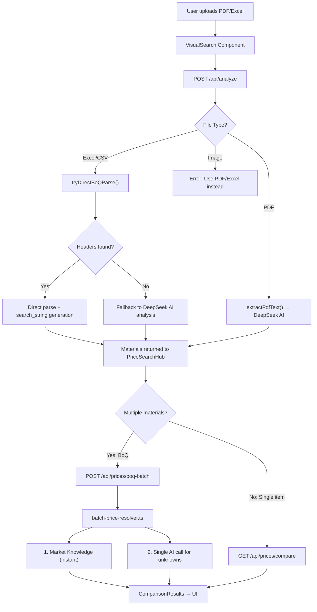

# BOQ Processing Pipeline — Implementation Summary

**Date:** 2026-05-23  
**Status:** ✅ Implemented & Build Verified  
**Last Updated:** 2026-05-23 (Batch pricing overhaul)

---

## Architecture Overview



## Key Files

| File | Purpose |
|------|---------|
| `src/app/api/analyze/route.ts` | File upload + extraction (Excel direct-parse, PDF AI, Image reject) |
| `src/app/api/prices/boq-batch/route.ts` | **NEW** Batch pricing endpoint for BoQ uploads |
| `src/app/api/prices/compare/route.ts` | Single-item price comparison (used for manual search) |
| `src/lib/boq-engine.ts` | Core BOQ utilities: parsing, dedup, normalization, `generateSearchString()` |
| `src/lib/batch-price-resolver.ts` | **NEW** Batch price resolution using market knowledge + AI |
| `src/data/sa-market-knowledge.ts` | Store profiles, product knowledge, regional adjustments |
| `src/components/VisualSearch.tsx` | Upload UI with progress tracking |
| `src/components/PriceSearchHub.tsx` | Price search UI with batch/single search routing |

## Pricing Strategy

### For BoQ Uploads (Multiple Materials)
1. **Market Knowledge (instant)**: Materials matching known categories (cement, bricks, steel, etc.) get prices from `sa-market-knowledge.ts` — zero API calls, instant results
2. **Batch AI Estimate (1 API call)**: Unknown materials are batched into a single DeepSeek call that returns all prices at once
3. **Result**: 50-item BoQ → 0-1 API calls instead of 100

### For Single Item Search
- Calls `/api/prices/compare` which uses DeepSeek for query parsing + scraper fallback
- This path is unchanged and works well for individual searches

## Search String Generation

The `generateSearchString()` function in `boq-engine.ts` strips BoQ verbiage from descriptions:

| BoQ Description | Generated Search String |
|----------------|------------------------|
| "Supply and install 50kg PPC Cement CEM II 42.5N including all necessary materials" | "50kg PPC Cement CEM II 42.5N" |
| "Provide and fix Corobrik Face Brick NFP as per specification" | "Corobrik Face Brick NFP" |
| "5.3.1 Allow for IBR Roof Sheeting 0.47mm x 6m complete with all accessories" | "IBR Roof Sheeting 0.47mm x 6m" |

## Performance Targets

| Scenario | API Calls | Target Time |
|----------|-----------|-------------|
| Single item search | 2-3 (parse + scrape/estimate) | < 5s |
| BoQ < 20 items (all known) | 0 | < 1s |
| BoQ 20-50 items (mixed) | 1 | < 5s |
| BoQ 50-100 items (mixed) | 1-3 (batched by 30) | < 10s |

## API Contracts

### POST `/api/analyze`

**Request:** `multipart/form-data` with `file` and `fileName`

**Response:**
```json
{
  "success": true,
  "mode": "direct-parse",
  "materials": [
    {
      "id": "boq-direct-Sheet1-0",
      "name": "PPC Cement 50kg",
      "category": "cement",
      "quantity": 10,
      "unit": "bag",
      "search_string": "PPC Cement 50kg"
    }
  ]
}
```

### POST `/api/prices/boq-batch`

**Request:**
```json
{
  "materials": [...],
  "lat": -26.2041,
  "lng": 28.0473
}
```

**Response:**
```json
{
  "success": true,
  "results": [
    {
      "material": {...},
      "quotes": [
        { "store": "cashbuild", "storeName": "Cashbuild", "price": 89.95, ... }
      ],
      "bestPrice": {...},
      "averagePrice": 95.50,
      "potentialSavings": 55.50,
      "source": "market-knowledge"
    }
  ],
  "stats": {
    "total": 20,
    "knowledgeMatched": 15,
    "aiEstimated": 5,
    "failed": 0
  }
}
```

---
*Updated by AI Agent — Batch Pricing Overhaul (2026-05-23)*
